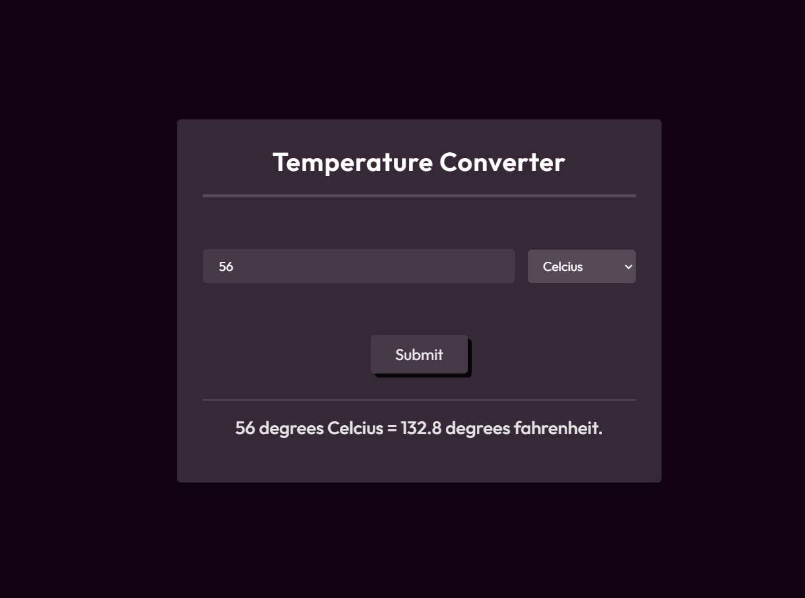

# Temperature Converter

Welcome to the Temperature Converter repository! This project is a JavaScript-based web application designed to convert temperatures between Celsius and Fahrenheit. Built with HTML, CSS, and JavaScript, it features a modern UI design for an intuitive and user-friendly experience.

## Preview



## Features

- **Celsius to Fahrenheit Conversion:** Convert temperatures from Celsius to Fahrenheit.
- **Fahrenheit to Celsius Conversion:** Convert temperatures from Fahrenheit to Celsius.
- **Modern UI Design:** Sleek layout and visually appealing design for an enjoyable user interface.

## Getting Started

To run the Temperature Converter locally, follow these steps:

1. Clone the repository to your local machine:

   ```bash
   git clone https://github.com/Devsethi3/Temperature-Converter.git
   ```

2. Open the `index.html` file in your preferred web browser.

## Usage

1. Enter the temperature value in the input field.
2. Select the unit (Celsius or Fahrenheit) of the entered temperature.
3. Click the "Convert" button to see the converted temperature.

## Customization

Feel free to customize this project to fit your preferences. Update styles, colors, and layout in the HTML and CSS files. You can also extend the functionality to include additional features or customization options.

## Contributing

If you'd like to contribute to this project, please follow these steps:

1. Fork the repository.
2. Create a new branch for your feature or improvement.
3. Make your changes and commit them with descriptive messages.
4. Push your changes to your forked repository.
5. Open a pull request to merge your changes into the main branch.

## License

Explore the Temperature Converter, convert temperatures effortlessly, and consider contributing to its development. Thank you for checking out the repository!